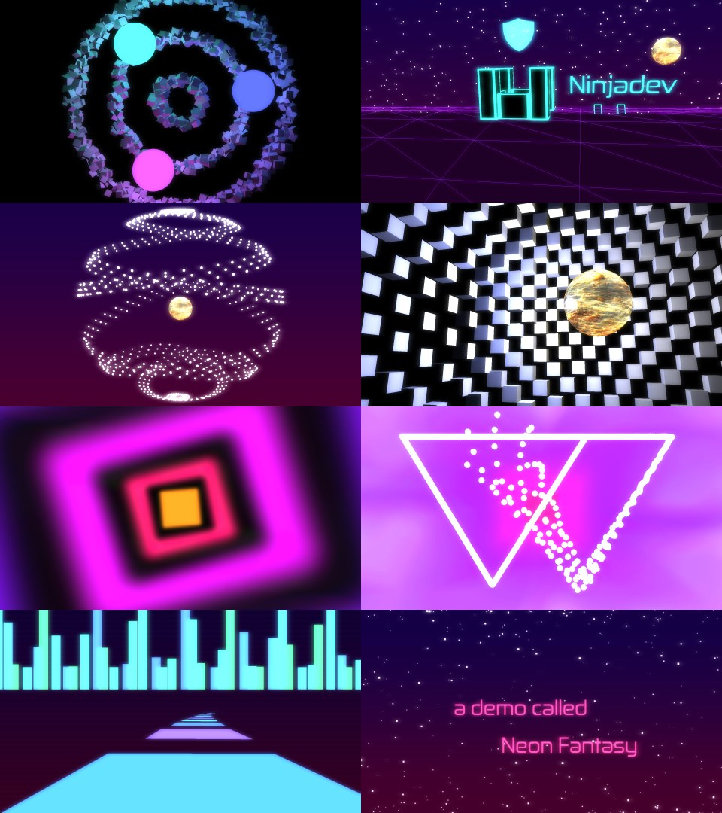

Neon Fantasy is a contribution to the ARM DemoCompo at Work-Work 2018-10-25

# Technology

We used Three.js, canvas and shaders (GLSL).
The demo was made with the help of the open source demo tool [nin](https://github.com/ninjadev/nin/), written in
JavaScript.

We tried to keep the demo lightweight, so it would run smoothly on a modern
mobile device. We tested it on a Sony Xperia XZ, where it ran smoothly, and a
Samsung Galaxy A3, where the FPS was below par.

Note: Please run the demo in Chrome, not in Firefox. In Firefox, there seems to
be something wrong with the synchronization between audio and visuals.

When you press the start button, the demo will try to put the browser in full screen mode.

# Effects

1. Glowing Orbs: fawds
2. Castles with shoutouts and animated stars: fawds
3. Grand Sphere with cube grid: fawds
4. Blurry tunnel: iverjo
5. WW logo: iverjo
6. Neon city race: iverjo
7. Outro: iverjo

# Music

Made in FL Studio 12 by iverjo, heavily inspired by The Midnight  
Lyrics: iverjo, with a little help from poem-generator.org.uk and rhymezone.com  
Talking: fawds  
Singing: iverjo  
Microphone: Zoom H2n

# Misc assets

Textures: One photograph of sunbeams on shallow water (by iverjo) and four
other textures, primarily made in Paint.NET.  
Font: Zekton, a free font by Typodermic Fonts. Thanks for the tip, stiaje!
